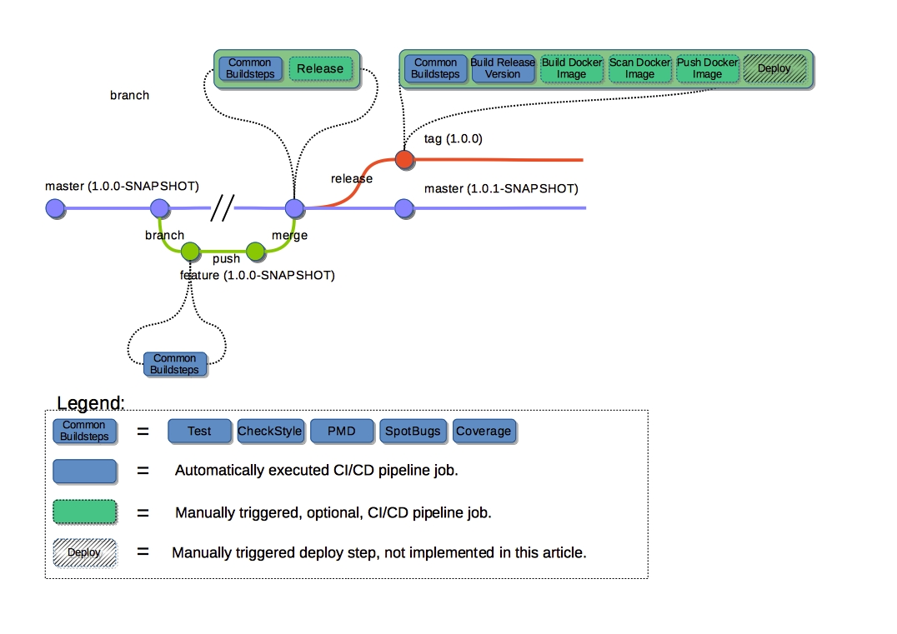

# Git Workflow Sample
A trivial Maven-based Spring Boot application that is used as an example project in which
a GitLab CI/CD pipeline for the following git workflow is added.

## Code Quality
The following Maven goals can be executed on the project to ensure code quality.
In the version of the project that has no CI/CD pipeline, these goals need to be executed manually.
 
<li>mvn -Pcicdprofile checkstyle:check
  Verify that the source-code adheres to the Ivan Coding Style.</li>
<li>mvn -Pcicdprofile pmd:check
 Performs source-code analysis checking for common programming flaws.</li>
<li>mvn -Pcicdprofile spotbugs:check
 Performs static code analysis looking for common bug patterns.
</li>
<li>mvn -Pcicdprofile install
 Ensure that the minimum amounts of code covered by tests is reached.</li>

## After
This branch contains the project after the GitLab CI/CD pipeline was added.
